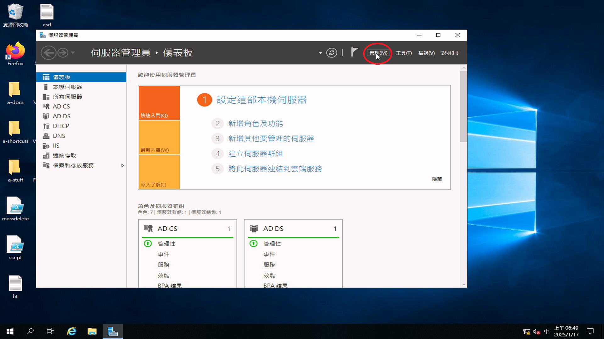
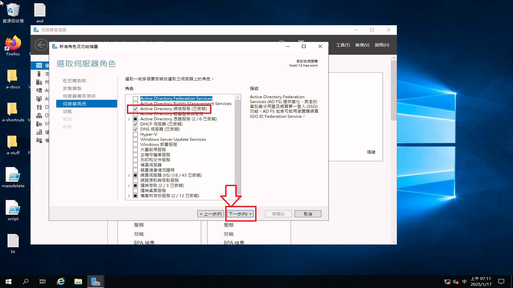
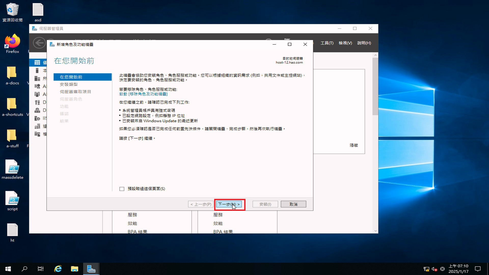
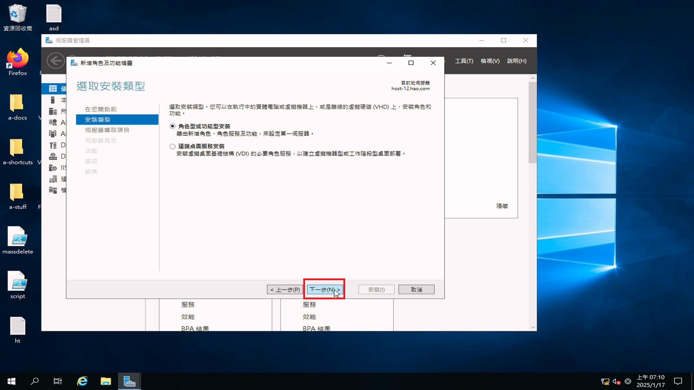
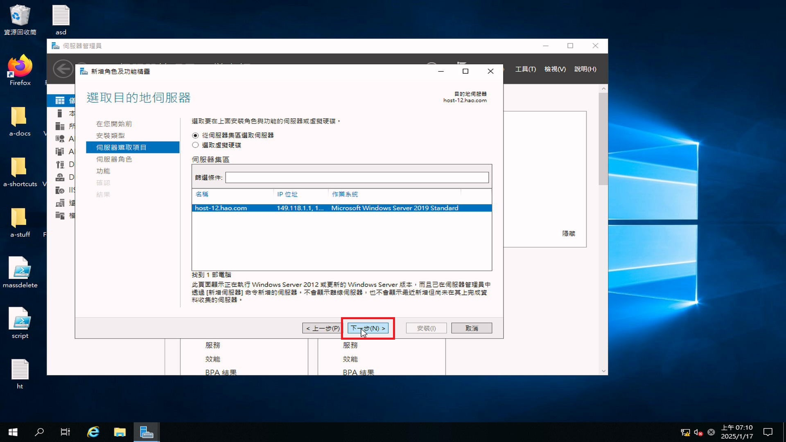
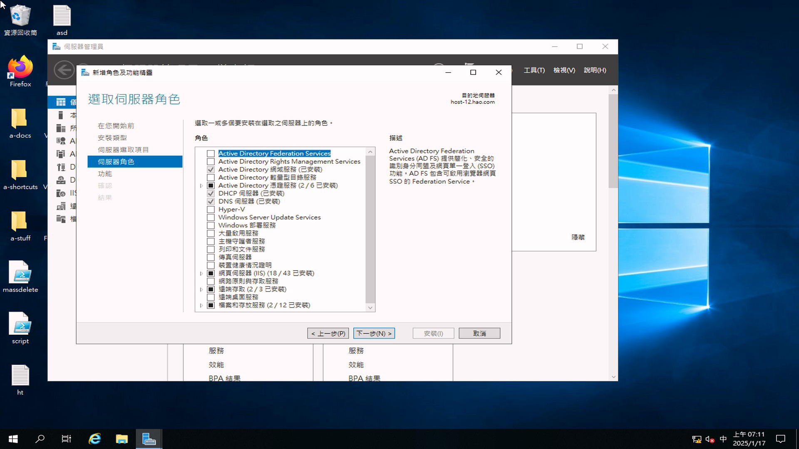

# 如何在 Windows Server 2019 安裝 Active Directory(AD)

## 影片教學
<video width="560" height="315" controls>
  <source src="/videos/ap-3.srv-content.mp4" type="video/mp4">
  Your browser does not support the video tag.
</video>

## 步驟
1. 按管理

2. 按新增角色與功能

3. 下一步，下一步，下一步

4. 選擇安裝 Active Directory Domain Services (網域服務)

5. 下一步，下一步，安裝
