# 如何在 Windows Server 2019 安裝 Active Directory(AD)

## 影片教學
<video width="560" height="315" controls>
  <source src="/videos/ap-2.srv-content.mp4" type="video/mp4">
  Your browser does not support the video tag.
</video>

## 步驟
### 網路設定(不准跳過!)
1. 點 <kbd>Windows</kbd>
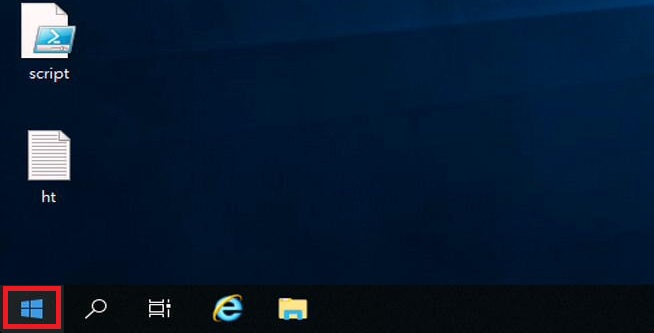

2. 點 Control Panel (控制台)
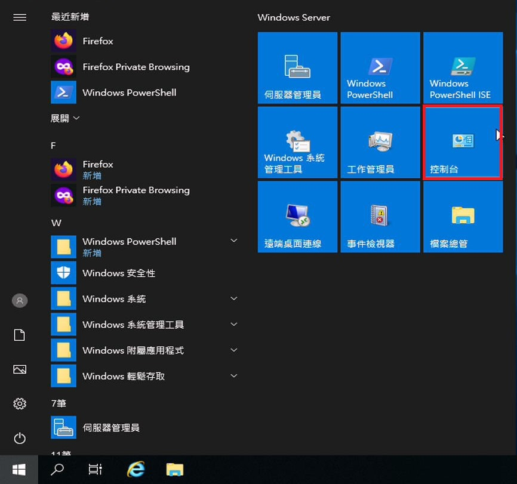

3. 點網路與網際網路
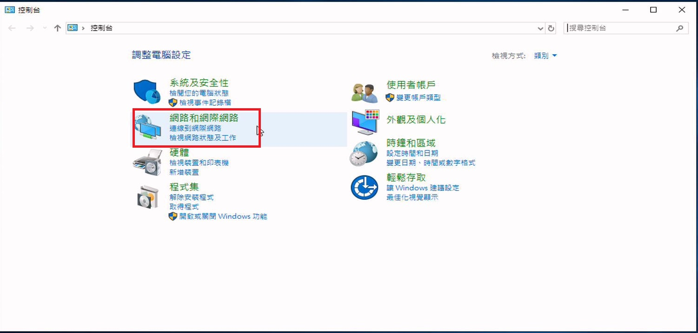

4. 點變更介面卡設定

5. 改網路卡的名稱
 

6. 在網路卡上點右鍵

7. 關掉 QoS 和 IPv6，並點選IPv4 並更改
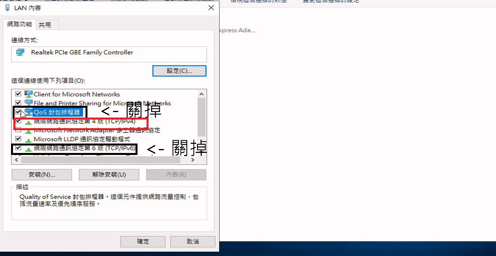

  - LAN 設定
    - 固定IP: 192.168.1.254
    - 子網路: 255.255.255.0
    - 路由: 192.168.1.254
    - DNS: 127.0.0.1 (localhost)
  - WAN 設定
    - 固定IP: 149.118.1.1
    - 子網路: 255.255.255.0
    - 路由: {空白}
    - DNS: 127.0.0.1 (localhost)
### 主機名稱(也不准跳過!)
(btw 這邊和影片中的順序不同)
1. 點選本機
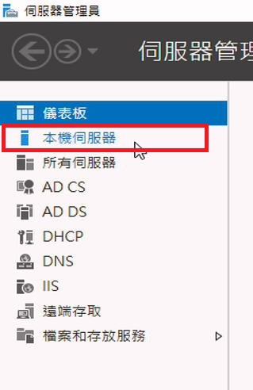

2. 點選名稱
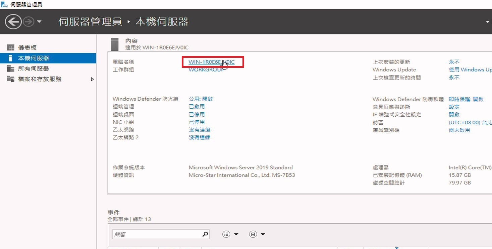

3. 點選修改

4. 更改機器名稱，設定成 HOST-(兩個數字)
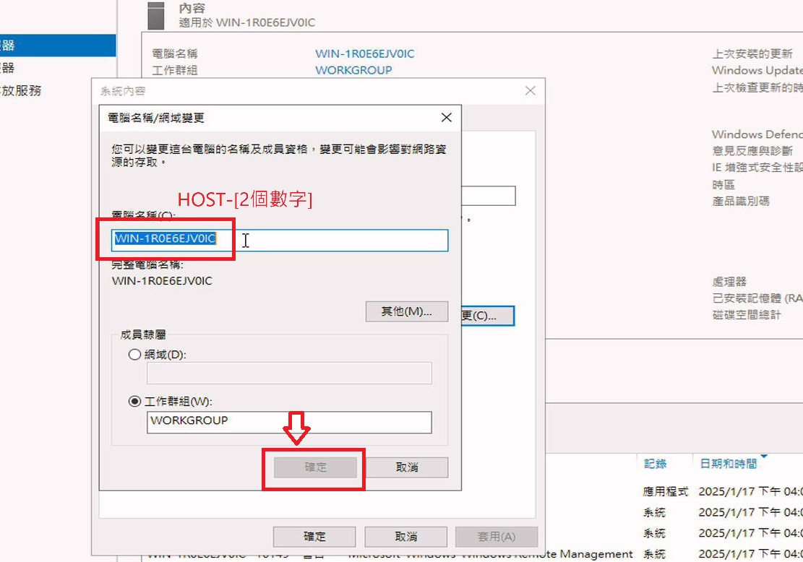

5. 按確定
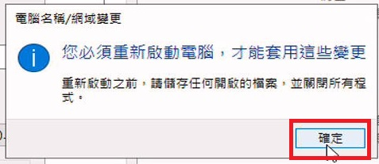

6. 按立刻重新啟動
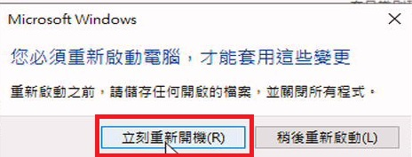

### AD
1. 按管理

2. 按新增角色與功能

3. 下一步，下一步，下一步

4. 選擇安裝 Active Directory Domain Services (網域服務)

5. 下一步，下一步，安裝

6. 按通知，並按將伺服器升級成網域控制站
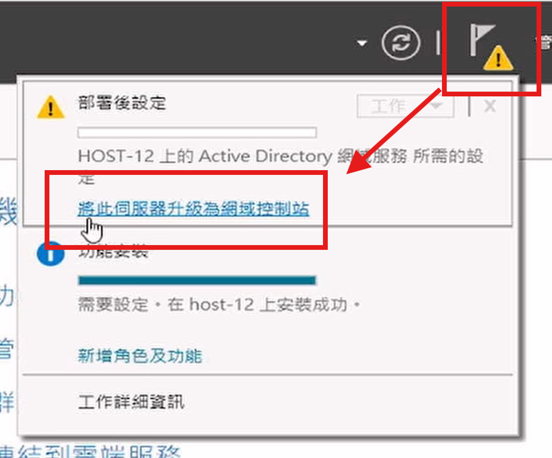

7. 按新增樹系，並輸入網域，例: tw.edu, yhw.tw
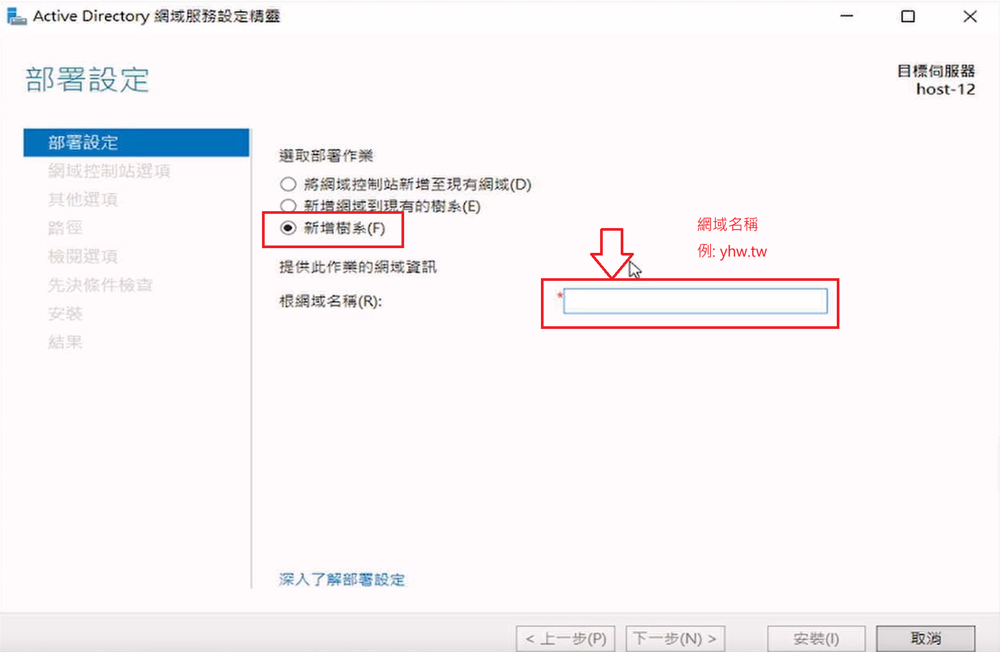

8. 設定網域管理員密碼 (請用 Administrator 的密碼)
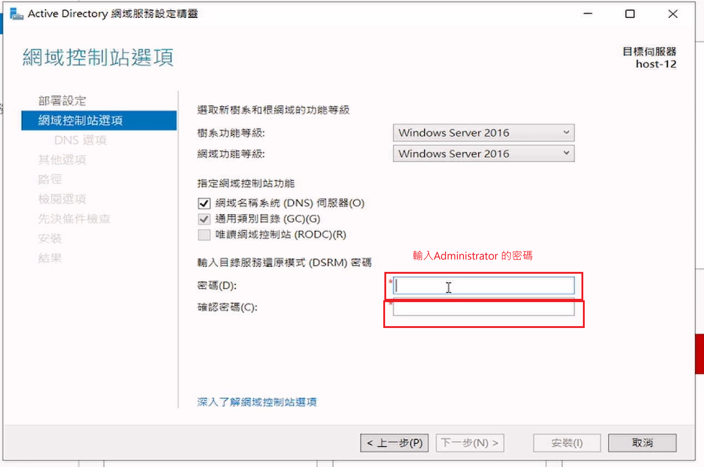

9. NETBIOS 的名稱會自動指派，建議不要改
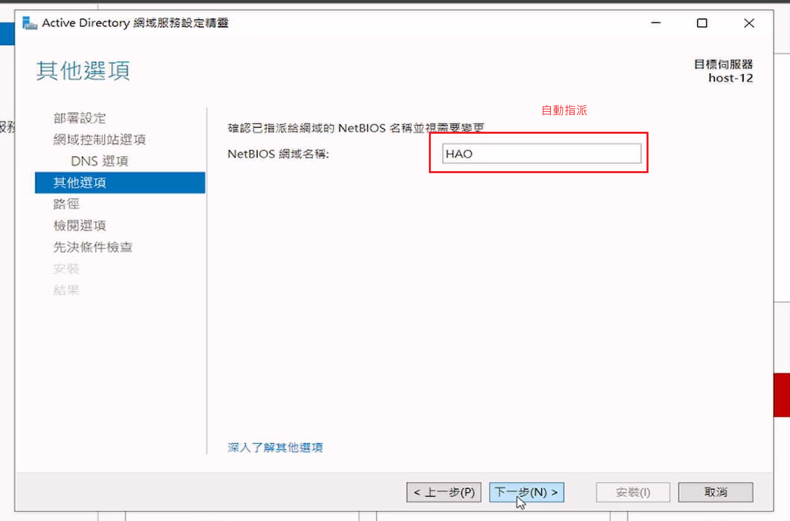

10. 跳過，直接按下一步
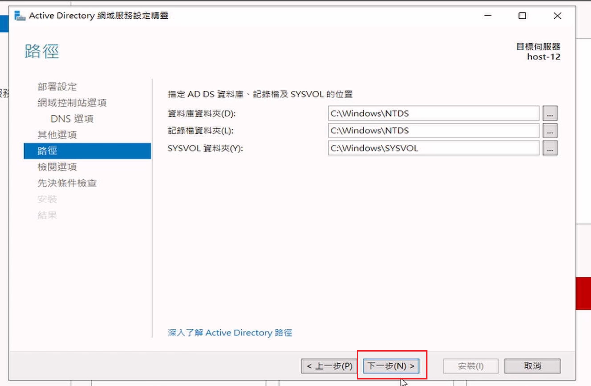

11. 關閉，系統會自己重新啟動
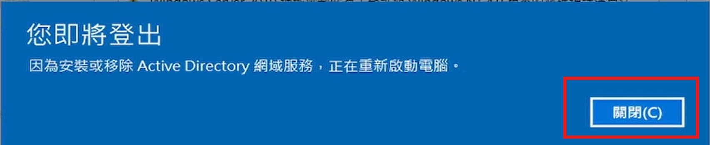

12. 系統自動重新啟動，並設定AD (這要等大約10分鐘，在等的同使，要不要順便泡一下咖啡或茶?)
13. 看到登入畫面，就代表完成了