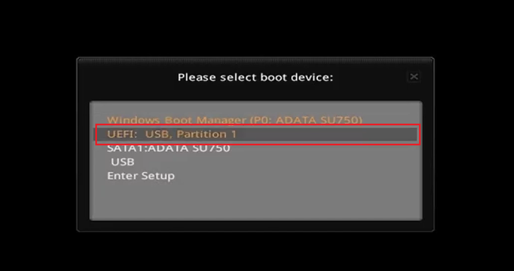
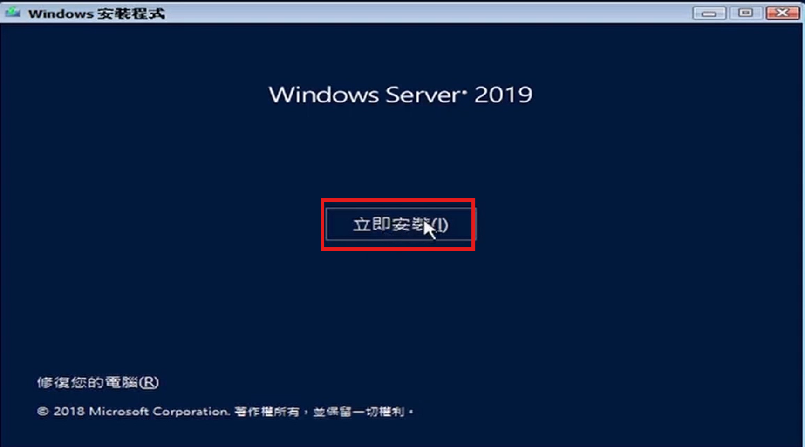
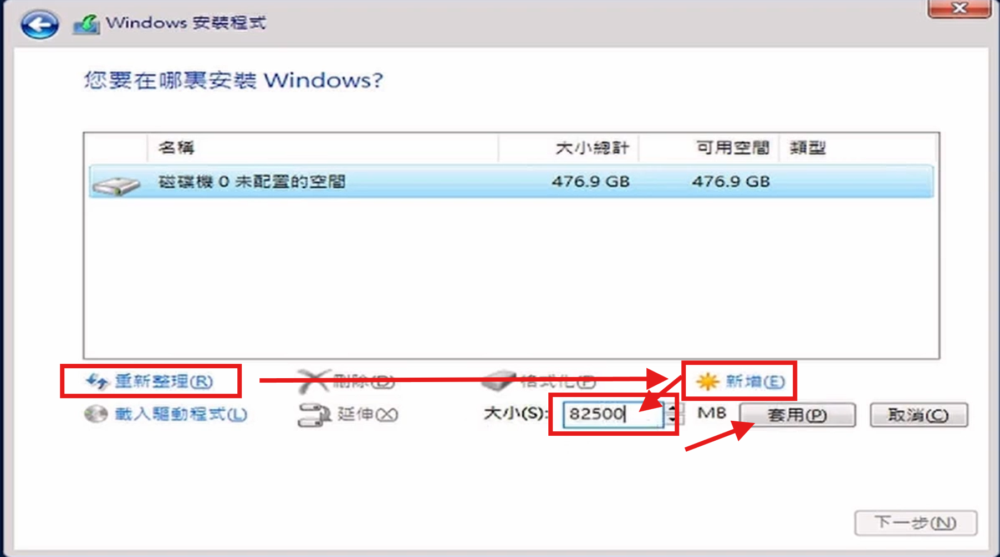
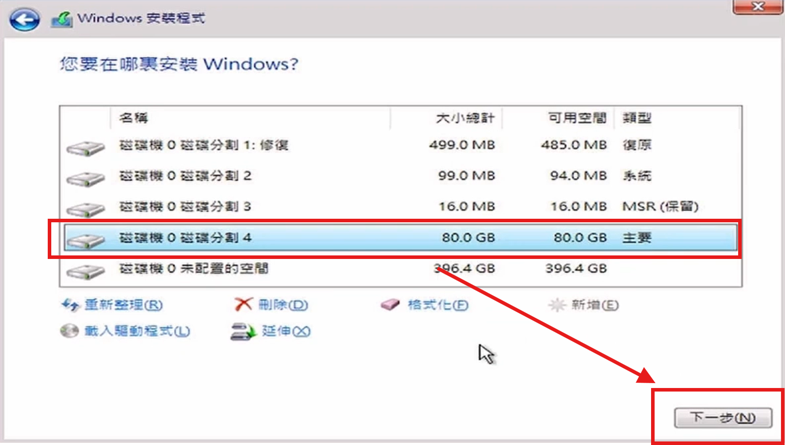
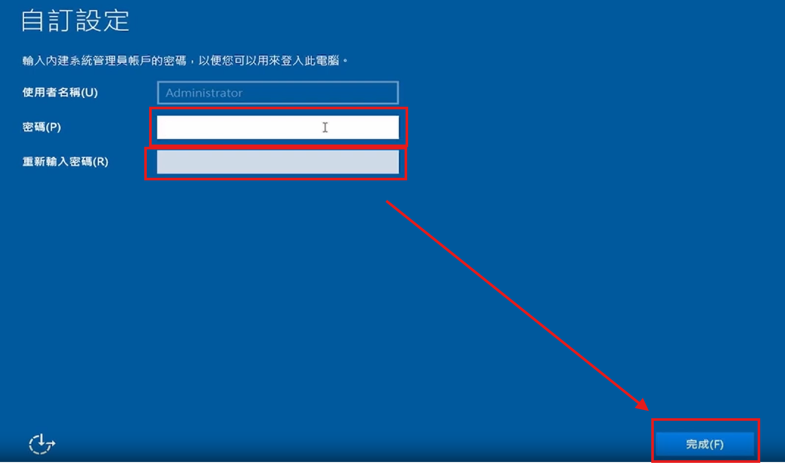

# 如何安裝 Windows Server 2019

## 影片教學
<video width="560" height="315" controls>
  <source src="/videos/ap-1.srv-content.mp4" type="video/mp4">
  Your browser does not support the video tag.
</video>

## 步驟

1. 打開主機
2. 在BIOS上按 <kbd>F11</kbd> 或 <kbd>F12</kbd> 鍵
3. 看到選擇開機裝置的畫面，選擇用USB的

4. 在Windows的安裝程式中，不要動上面的地區設定，下一步

5. 安裝，下一步，同意條款，下一條

6. 如果之前機器有安裝過，可以慢慢刪，但有比較快的方式
    1. <kbd>Shift</kbd> + <kbd>F10</kbd>
    2. ```diskpart```
    3. ```list disk```
    4. ```select disk 0``` 或是在 list disk 的第0個
    5. ```clean```
7. 之後在新增輸入 82500 (MiB) 並按確定

8. 選擇80.0G 的並按確定

9. 並等待
10. 在藍色的畫面上輸入密碼（密碼為 Skills@2025）

11. 安裝完成
