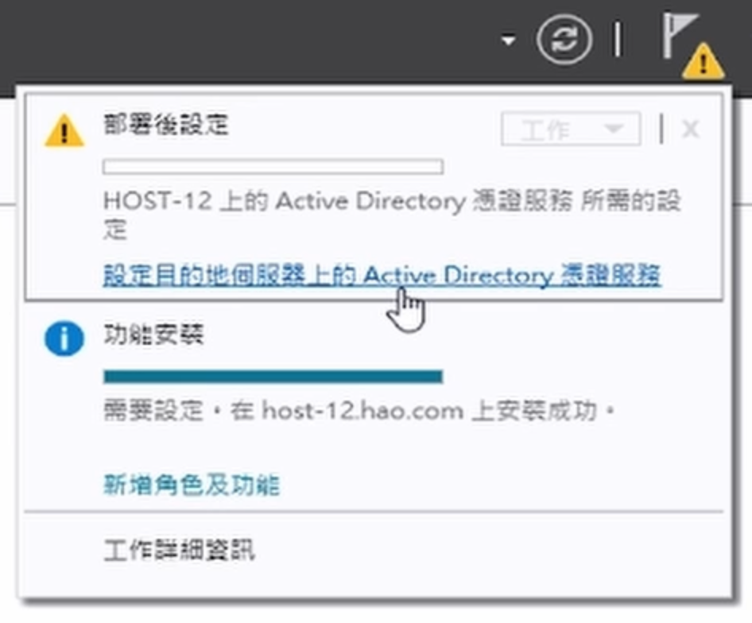

# 如何在 Windows Server 2019 安裝 Active Directory(AD)

## 影片教學

<video width="560" height="315" controls>
  <source src="/videos/ap-3.srv-content.mp4" type="video/mp4">
  Your browser does not support the video tag.
</video>

## 步驟
1. 按管理

2. 按新增角色與功能

3. 下一步，下一步，下一步

4. 選擇安裝 Active Directory Domain Services (憑證服務)

5. 下一步，下一步

6. 在這裡 按 **憑證授權網頁註冊**

7. 下一步，安裝

8. 按上面的通知，並按 **設定目的伺服器上的Active Directory 憑證服務**

9. 下一步後，全選，之後就是一直下一步，就設定完成了！ :3