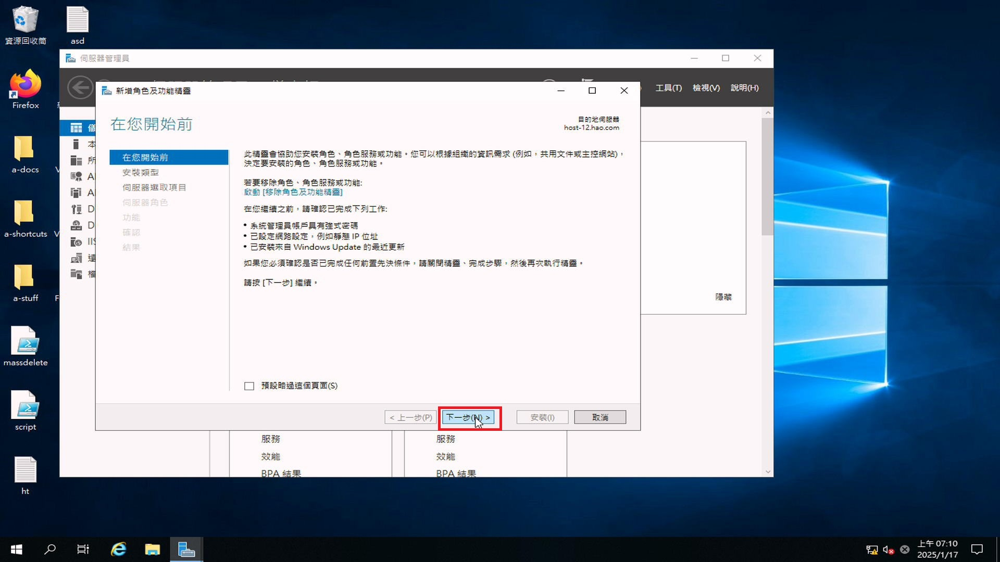
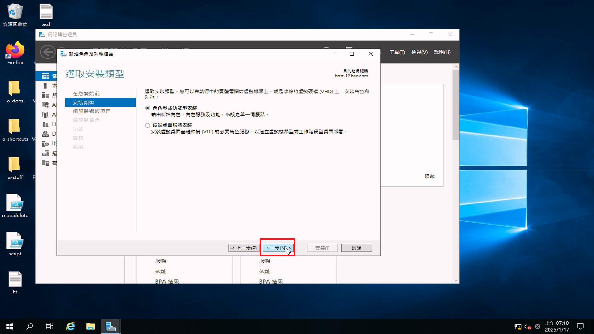
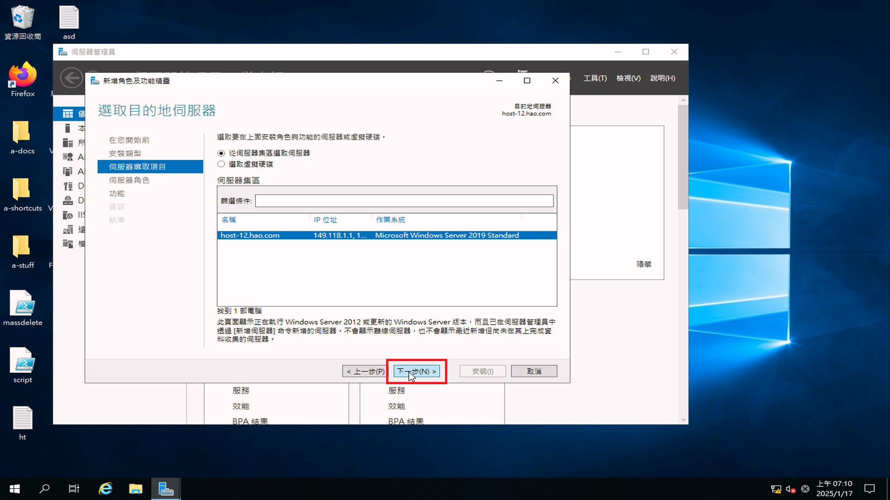
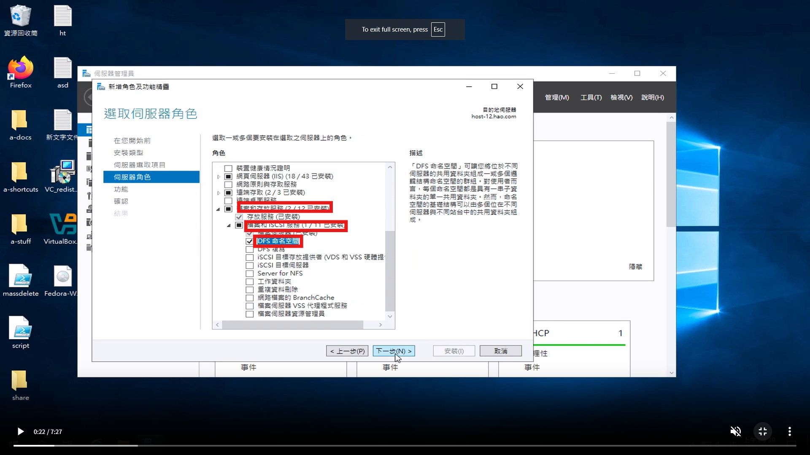
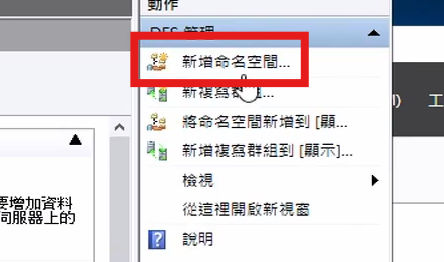
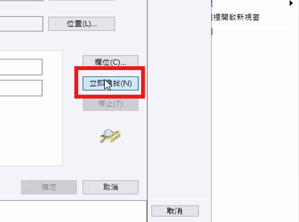
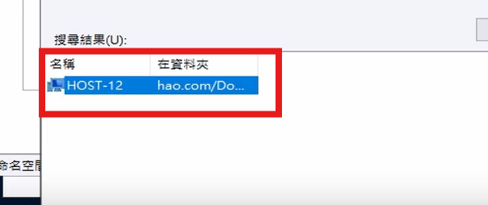

# 如何在 Windows Server 2019 設定 DFS 與 在所有機器上設立 P:// 的網路硬碟

## 影片教學

<video width="560" height="315" controls>
  <source src="/videos/ap-8.srv-content.mp4" type="video/mp4">
  Your browser does not support the video tag.
</video>

## 步驟

1. 按管理

2. 按新增角色與功能

3. 下一步，下一步，下一步

4. 在 **檔案和存放服務** 裡的 **檔案與 iSCSI 服務** 選擇安裝 **DFS 命名空間**

5. 下一步，下一步，完成

6. 按 <kbd>Windows</kbd> 鍵，並打入 **DFS 管理**，並按 Enter

7. 按 **新增命名空間**

8. 按 **瀏覽**，並按 **進階**，按下去旁邊的 **立即尋找**

9. 按你的主機

