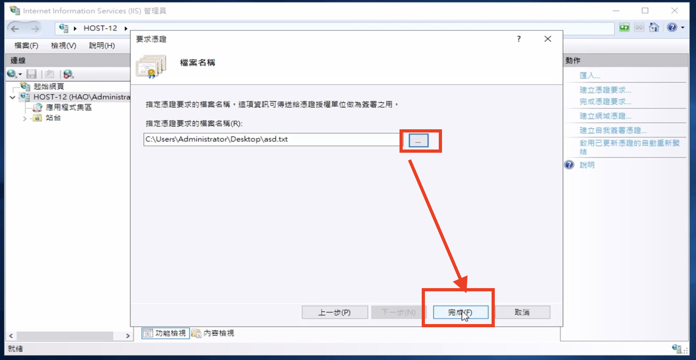
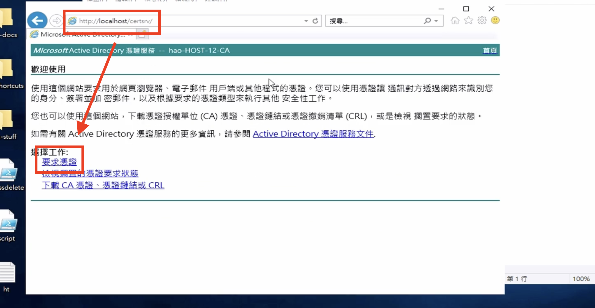
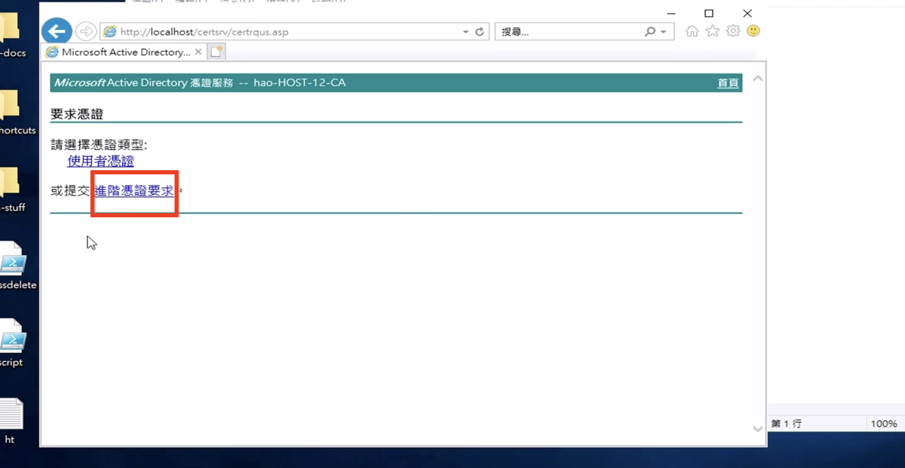
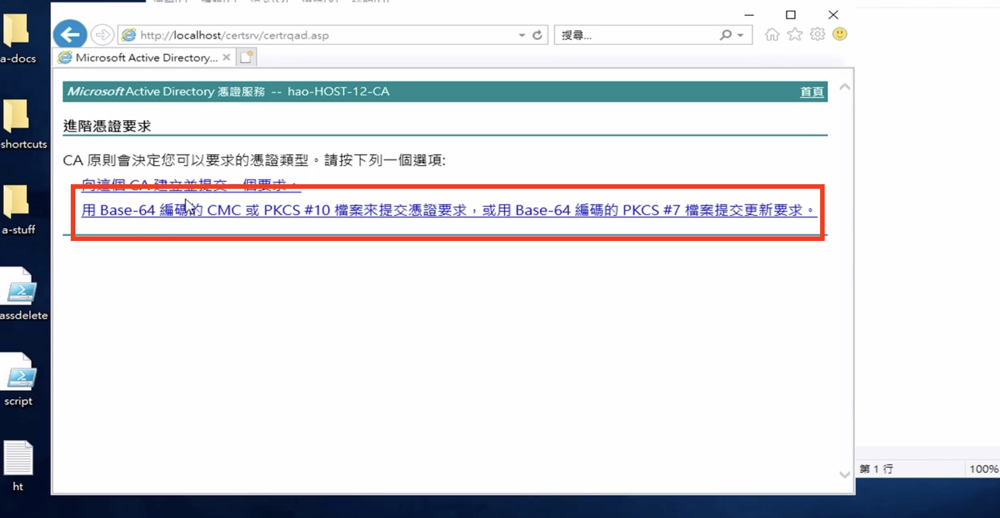
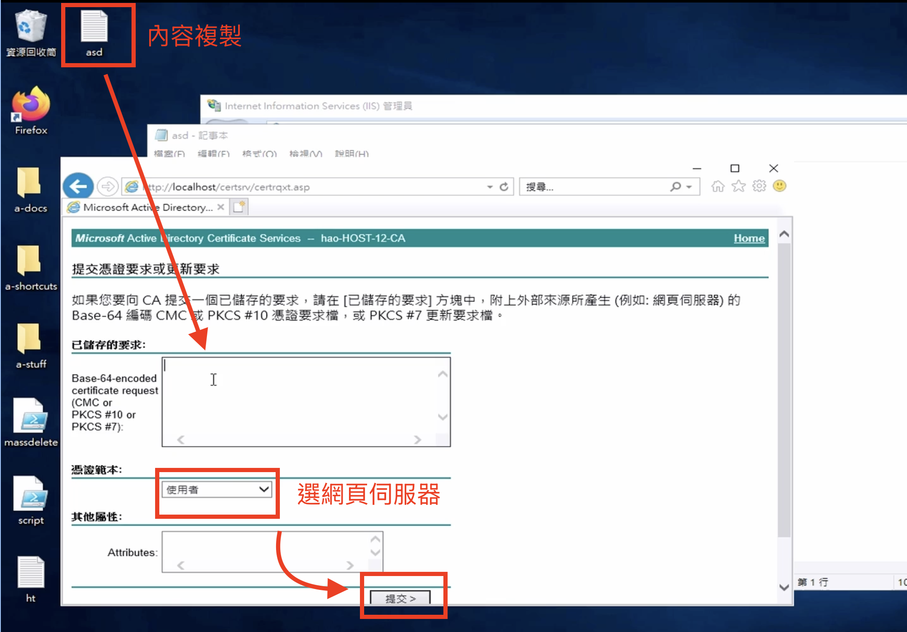
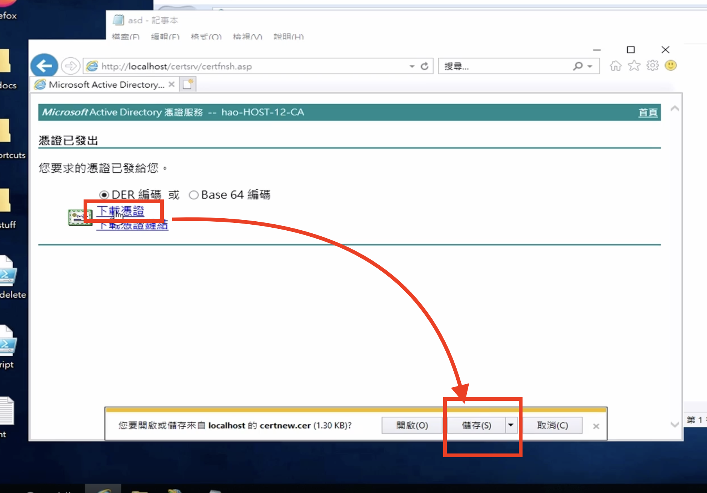
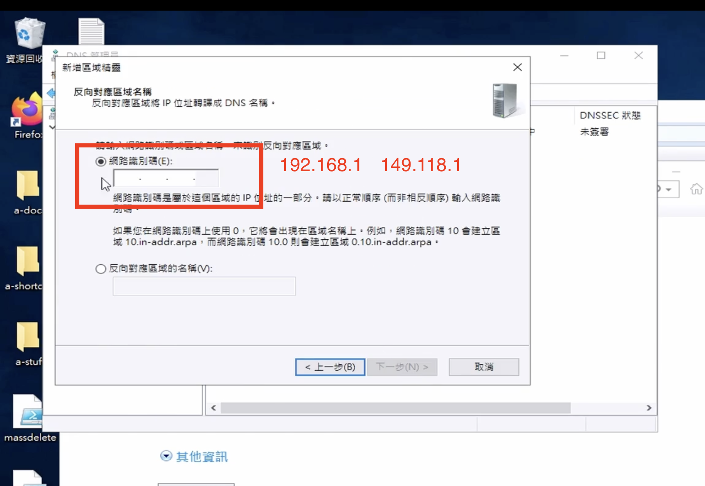
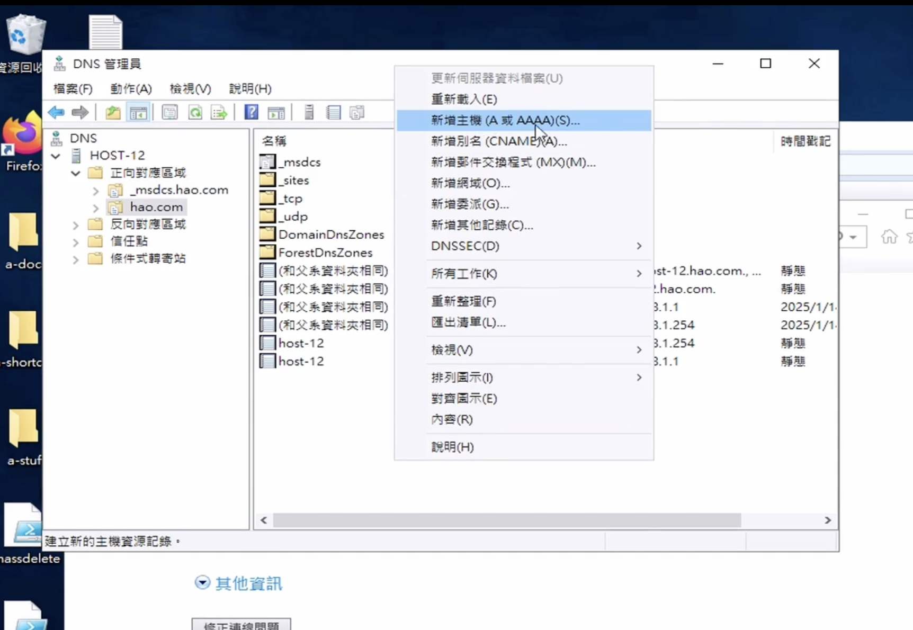
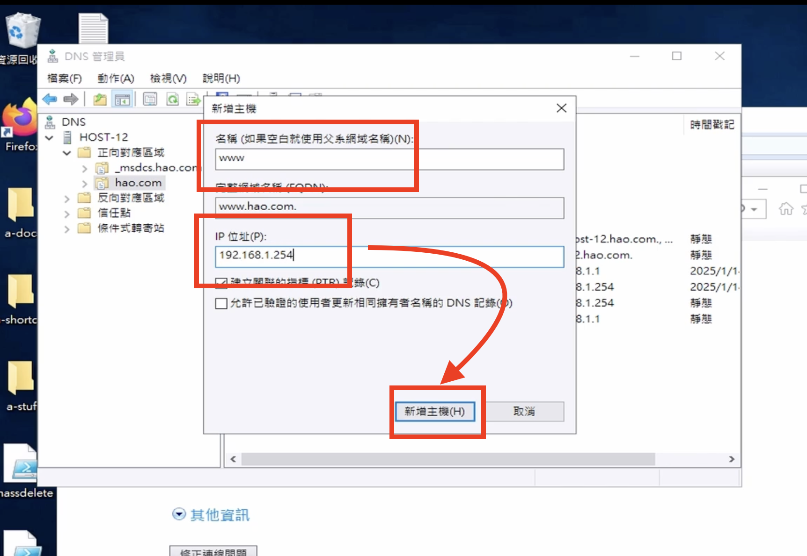
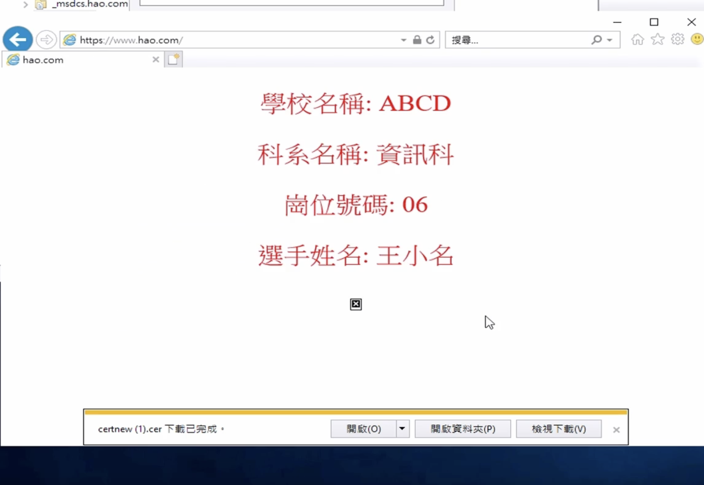

# 如何在 Windows Server 2019 安裝 IIS 並 取得憑證

## 程式碼

[index.html](/windows/scripts/web.html#_113)
## 影片教學

<video width="560" height="315" controls>
  <source src="/videos/ap-6.srv-content.mp4" type="video/mp4">
  Your browser does not support the video tag.
</video>

## 步驟
**如果還沒有安裝 Active Directory Certificate 的 請先設定完 Active Directory Certificate 再來做IIS**

### 申請憑證
1. 回到 **伺服器管理員**，點擊 **工具 (Tools)**，選擇 **IIS 管理員**

2. 按下左側 **伺服器名稱**，並選擇 **伺服器憑證 (Server Certificates)**


3. 點擊 **建立憑證申請 (Create Certificate Request)**

4. 填寫憑證資訊：
    - 常用名稱： 必須是你要的網域 (ex: www.obyhw.tw)
    - 剩下的隨便填就好


5. 點擊 **下一步** **下一步**

6. 指定憑證請求的保存位置，點擊 **完成**



7. 點開txt檔，並複製到剪貼簿上

8. 打開 IE，並輸入 ```http://localhost/certsrv``` 或是 ```http://host-12.obyhw.tw```



9. 按要求憑證，並按進階憑證要求



10. 按用 Base-64 編碼的 CMC ... 要求，並在 Base-64-encoded certificated request 輸入欄位中複製你剛剛複製的 Base-64



11. 憑證範本為網頁伺服器（Web），並按提交



12. 下載憑證後打開IIS 並 按完成憑證要求




13. 完成


### 設立網站
1. 進入 IIS 的程式介面 

2. 在左側欄選擇伺服器名稱，點擊 **網站**，然後右鍵選擇 **新增網站 (Add Website)**。

3. 輸入網站名稱 ```www.你的網域``` (ex: ```www.obyhw.tw```)

4. 輸入實體路徑 C://Web

5. 綁定 https 憑證 (在前面創立的那個) 並關閉 https/2

6. 點擊 **確定** 完成網站的新增。

### 設立 DNS
1. 按下 <kbd>Windows</kbd> 鍵，並輸入DNS，打開第一個選項

2. 設立反向代理服務
    1. 先點入反向代理服務 
    2. 在反向代理服務按右鍵，並一直按下一步
    3. 要設定兩個IP，一個內網，一個外網
	    1. 內網為 192.168.1
	    2. 外網為 149.118.1
	4.  下一步
	


1. 回到**正向對應區域**，點 你的網域 (ex: obyhw.tw)

2. 在比較大的UI裡按右鍵，並按增加主機(A or AAAA Record)
		(PS: A 為 IPv4, AAAA 為 IPv6)



5. 並在名稱上輸入 www (如果要 www.obyhw.tw 的話)，在IＰ位置輸入 192.168.1.254（主機）並安建立



### 驗證
打開 IE 並 輸入 ```https://你的網域``` (ex: ```https://www.obyhw.tw``` )

結果：

